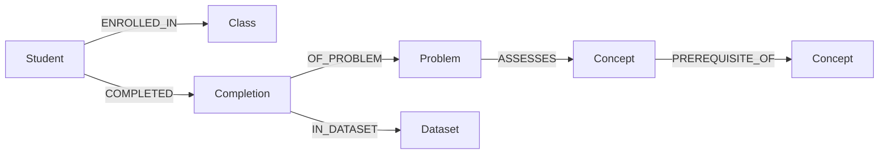

# Neo4j mathematics graph

The local Neo4j database combines the original ontology and synthetic SQLite fixture with an additional five-student synthetic cohort. It contains **20 students, 96 problems, 600 completions, 48 concepts, 80 prerequisite relationships, and 2 source datasets**: **769 nodes and 1,996 relationships** total after the teacher application adds three grade-based `Class` nodes and 20 `ENROLLED_IN` relationships.

## Open the graph

Neo4j Browser: **http://localhost:7474/browser/**

- Connection: `bolt://localhost:7687`
- User: `neo4j`
- Database: `neo4j`
- Password: open the project-root `.neo4j.env` file and copy `NEO4J_PASSWORD`.

The password is generated locally, stored with owner-only permissions, and excluded from version control. The server binds to the local machine only. Run the queries in `browser-queries.cypher` in Neo4j Browser, one statement at a time, and choose the graph view when returning paths.

Start and stop the persistent database from the project root:

```sh
npm run graph:start
npm run graph:status
npm run graph:stop
```

Data lives under `.runtime/neo4j-community-5.26.30/data/` and survives stop/start. This is a project-local daemon, not a login service; run `graph:start` after reboot. Do not delete `.runtime` or `.neo4j.env` to restart the database.

If your execution environment stops detached background processes, use `npm run graph:console` and leave that terminal running. The current assistant session uses this console mode. Stop a console-mode server with Ctrl+C in its terminal.

## Graph model



| Node | Identifier | Properties |
|---|---|---|
| `Concept` | `concept_id` | Original name, category, definition, and grade band. |
| `Class` | `class_id` | Synthetic grade cohort name, grade, and grouping rule. |
| `Student` | `student_id` | Fictional display name, grade, synthetic flag. |
| `Problem` | `problem_id` | Prompt, answer key, response format, variant, primary concept ID. |
| `Completion` | `completion_id` | Student/problem IDs, sequence number, attempts, hints, correctness, response, elapsed seconds, timestamps, four affect ratings, provenance. |
| `Dataset` | `dataset_id` | Cohort name, synthetic flag, seed, and source metadata. |

All mathematical prerequisite edges retain their original direction and rationale. Performance and affect are properties of individual completion records, not concept properties or permanent student attributes. Ratings are independent integers from 1 (very low) to 5 (very high), explicitly marked as simulated post-problem self-reports. A completed activity may end with an incorrect answer.

Timestamps are Neo4j `datetime` values; counts and ratings are integers; correctness and synthetic flags are booleans. `Completion` is the aggregate of all submissions for one problem interaction, not a single answer attempt. The original fixture assumptions and field definitions remain documented in `../synthetic_data/README.md`.

## Imported data and expansion

- `data/base.json`: all 15 original students and all 450 original completion records, exported from SQLite without changing the source.
- `data/cohort-02.json`: five additional students, STU_016–STU_020, with 150 fresh synthetic completion records. Their concept selections draw on original cohort templates, while responses, attempts, hints, affect, and timing are newly generated.
- Both cohorts use the existing 96 authored problems and the same 48-concept ontology. The expansion adds observations, not new mathematical claims.
- Each student has 30 completions across 15 concepts. Both cohorts use fictional September 2026 histories; the new cohort is not a claim that time has advanced.

Imports use unique constraints and `MERGE`. Re-running an unchanged batch updates matching records without duplication. Imports are additive: omitting a record does not delete it. Source dataset IDs, student IDs, problem IDs, and completion IDs should be stable. A completion cannot be reassigned to another student, problem, sequence, or dataset, and a problem cannot be reassigned to a different concept.

```sh
# Refresh the import file from the unchanged source SQLite database.
npm run graph:prepare

# Import or reimport both current batches.
npm run graph:import -- graph/data/base.json
npm run graph:import -- graph/data/cohort-02.json

# Generate an additional cohort with unused student IDs, then import it.
npm run graph:expand -- --students 5 --start-id 21 --batch cohort-03 --seed 20260922
npm run graph:import -- graph/data/cohort-03.json

# Check the live graph and produce a portable JSON snapshot.
npm run graph:verify
npm run graph:export
```

For custom additions, create a JSON batch with the same top-level structure as `data/base.json`: `dataset`, `concepts`, `prerequisite_edges`, `students`, `problems`, and `completions`. Unchanged arrays may be empty when their referenced nodes already exist. A new concept needs a unique ID and the ontology fields; a new problem must reference an existing or included concept. Use new completion IDs and increasing student sequence numbers to add further practice, including another interaction with the same problem. Unlike the original SQLite fixture, the graph permits repeated student–problem interactions when each completion has its own identity.

The generated cohort command rewrites its selected batch JSON deterministically; use a new `--batch` and unused `--start-id` for each addition. Import supports property updates on stable identities. The verification command intentionally checks that original fixture values remain unchanged; changing original data will fail that preservation check.

The importer validates the combined current graph and incoming batch before committing: valid foreign references, no cycles, no duplicate IDs or student sequences, valid affect scales, consistent canonical answer flags, and nonoverlapping timestamp histories with matching durations. Counts and all data changes for a batch commit in one transaction. Schema creation occurs separately. Use a single importer at a time; the full in-memory validation and all-upstream queries suit this small dataset and should be redesigned for large production workloads.

Missing observations remain missing and are returned with null averages. Queries display evidence; they do not classify mastery or diagnose knowledge gaps. Correctness validation uses the fixture's canonical answer strings, not a mathematical equivalence grader.

## Queries

```sh
npm run graph:query -- overview
npm run graph:query -- student --student STU_016
npm run graph:query -- upstream --student STU_001 --concept MATH_034
npm run graph:query -- shared-foundations --student STU_001 --concepts MATH_034,MATH_041,MATH_047
```

The shared-foundations query counts distinct target concepts, not the number of graph paths. Student observations are deduplicated from prerequisite paths before aggregation.

`graph/verification.json` records the latest successful live verification. `graph/exports/graph-snapshot.json` is a readable export of all six node types, prerequisite edges, and enrollment edges; the other relationships can be reconstructed from the retained IDs. To restore the delivered graph into an empty instance, import `data/base.json` and `data/cohort-02.json` in that order. Start the teacher application to recreate the three synthetic grade cohorts. Restart it after importing new students so their grade enrollments are added; then refresh the UI. Preserve any later batch files to restore later additions.

`npm run graph:check` runs a live integration check for the delivered 20-student fixture: original record preservation, reimport idempotence, invalid-batch rejection without data changes, missing-observation handling, and upstream/shared-foundation query counts. It also refreshes the JSON snapshot. Its exact-count expectations intentionally apply before adding further cohorts; use `graph:verify` after expansion.

## Installation and configuration

This workspace uses Neo4j Community **5.26.30 LTS**, Java **21**, and the official Neo4j JavaScript driver **6.2.0**. Java and Neo4j are isolated under `.runtime`; no system Java installation or Docker is required. The local setup script targets **macOS ARM64**. Downloads come from Neo4j and Eclipse Adoptium and are SHA-256 checked before extraction.

```sh
npm install
npm run graph:setup
npm run graph:start
npm run graph:prepare
npm run graph:expand
npm run graph:import -- graph/data/base.json
npm run graph:import -- graph/data/cohort-02.json
npm run graph:verify
npm run graph:test
```

The local setup script pins the Neo4j release; do not run it against an independently configured server. Existing remote instances can be used by setting `NEO4J_URI`, `NEO4J_USERNAME`, `NEO4J_PASSWORD`, and `NEO4J_DATABASE` in the environment; environment values override `.neo4j.env`. The local start/stop commands always manage the project-local instance. A remote URI such as `neo4j+s://...` uses the driver's encrypted transport; use a dedicated database for this dataset.

References: [Neo4j deployment center](https://neo4j.com/deployment-center/), [Java compatibility](https://neo4j.com/docs/operations-manual/current/installation/requirements/), [macOS installation](https://neo4j.com/docs/operations-manual/current/installation/osx/), [official JavaScript driver](https://neo4j.com/docs/javascript-manual/current/).
