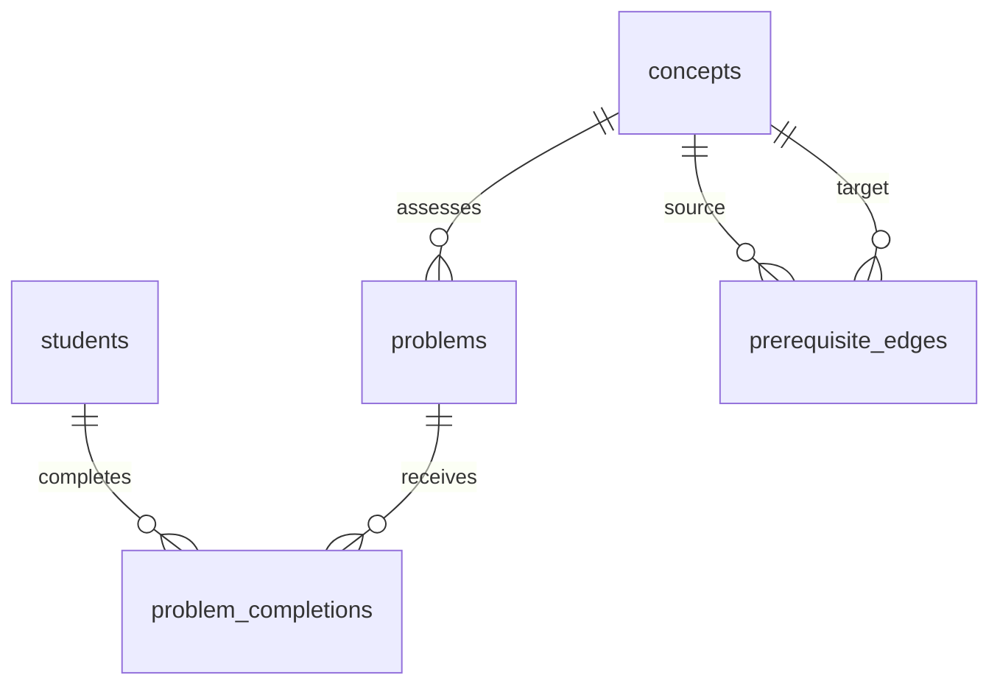

# Synthetic mathematics student database

This is entirely fictional data for prototyping with the existing mathematics ontology. It contains no real students, measured affect, or observed performance. The original ontology is unchanged; student activity is a separate relational layer linked through concept IDs.

## Contents

| Content | Count |
|---|---:|
| Fictional students, grades 7–9 | 15 |
| Ontology concepts | 48 |
| Original prerequisite relationships | 80 |
| Authored problems, two per concept | 96 |
| Completed-problem records | 450 |
| Completed problems per student | 30 |
| Observed concepts per student | 15 |
| Records per observed student–concept pair | 2 |

All 48 concepts and all 96 problems occur in the activity records. Each student's concept subset includes foundational review and pre-algebra/algebra practice. Unobserved student–concept combinations have no records; their absence does not mean success, failure, or zero activity outside this fixture.

Open `synthetic_students.sqlite` in any SQLite client. Open `csv/completion_details.csv` for a flat, readable view of all 450 records. `synthetic_student_database.zip` contains the database, exports, schema, SQL dump, documentation, generation script, and source ontology snapshot.

## Schema and relationships



| Table or view | Row meaning |
|---|---|
| `students` | One fictional student, labeled Synthetic Student 01–15. |
| `concepts` | One unchanged concept from `ontology.json`. |
| `prerequisite_edges` | One unchanged directed `PREREQUISITE_OF` relationship with its original rationale. |
| `problems` | One authored problem assessing a single primary concept. |
| `problem_completions` | One student's completed interaction with one problem, aggregating all attempts and hints. |
| `dataset_metadata` | Dataset provenance, seed, source hash, and field semantics. |
| `completion_details` | View joining activity records to student, concept, and problem descriptions. |
| `student_concept_summary` | View aggregating the two records for an observed student–concept pair. |

The two summary records per concept illustrate only a small sample. The database contains no mastery classifications or inferred gap diagnoses.

## Activity data dictionary

| Field | Type / unit | Meaning |
|---|---|---|
| `completion_id` | Text ID | Unique completed-problem record, e.g. CMP_0001. |
| `student_id` | Foreign key | Links to STU_001–STU_015. |
| `problem_id` | Foreign key | Links to a prompt, primary concept, and answer key. |
| `sequence_no` | Integer, 1–30 | Chronological sequence within the student's activity history. |
| `started_at_utc` | ISO 8601 UTC timestamp | Start of the problem interaction. |
| `completed_at_utc` | ISO 8601 UTC timestamp | End of the problem interaction. |
| `time_taken_seconds` | Positive integer, seconds | Total elapsed problem time, including reading, all attempts, and hint use. It equals completion minus start. |
| `attempt_count` | Integer, 1–5 in this fixture | Number of submitted answers, including the initial submission. Earlier submissions, when present, are assumed incorrect; only the final response is stored. |
| `hints_used` | Integer, 0–4 in this fixture | Total hint requests for the problem. Multiple hints can precede one submission; hints need not be bounded by attempts. Hint text and event timestamps are not stored. |
| `final_response` | Text | Final submitted answer, drawn from the authored correct answer or a plausible distractor. |
| `final_is_correct` | Integer boolean, 0 or 1 | Whether the final response is correct. A completed interaction can still end incorrectly. |
| `confidence` | Integer, 1–5 | Simulated post-problem confidence in the response/understanding. |
| `confusion` | Integer, 1–5 | Simulated post-problem sense of not understanding the problem or steps. |
| `determination` | Integer, 1–5 | Simulated post-problem willingness to persist with the mathematics. |
| `frustration` | Integer, 1–5 | Simulated post-problem frustration with the experience. |

All four affect fields use independent ordinal ratings: **1 = very low, 2 = low, 3 = moderate, 4 = high, 5 = very high**. They are not probabilities and do not sum to a fixed total. High determination and high frustration may coexist. Affect is simulated as if reported at completion; it is not inferred from attempts, time, facial expressions, or actual student behavior. Associations in the fixture are generation assumptions, not empirically calibrated relationships.

`final_is_correct` is consistent with the authored canonical answer. Equivalent mathematical expressions are not automatically graded: correct answers use a canonical spelling. `answer_format` specifies how to interpret each answer; numeric answers are stored as text alongside fractions, equations, sets, and words.

## Other fields

- `students`: `display_name` is a fictional label; `grade_level` is 7, 8, or 9; `is_synthetic` is always 1.
- `concepts`: `concept_id`, `concept_name`, `category`, `short_definition`, and `grade_band` come directly from the ontology. A grade band is not a student's assigned grade.
- `prerequisite_edges`: `source_concept_id` is the prerequisite, `target_concept_id` is the dependent concept, and `rationale` preserves the existing explanation.
- `problems`: `problem_variant` distinguishes the two distinct authored problems for a concept; `prompt`, `correct_answer`, and `answer_format` describe the task. Variant number does not imply a calibrated difficulty level.
- `completion_details`: includes `concept_id` and `concept_name` through the problem relationship, avoiding inconsistent duplicate concept assignments in the base activity table.
- `student_concept_summary`: `final_accuracy` is correct final responses divided by problems completed, on a 0–1 scale; `first_attempt_correct` counts records with one attempt and a correct final response. Time means use seconds. Other means retain their source scales. Affect means are convenient fixture summaries of ordinal ratings, not validated psychometric scores.

## Generation and validation

The record period is September 1–18, 2026 (UTC). Each student has six nonoverlapping practice sessions of five problems. The two variants for a concept appear in separate portions of the history. Student-specific and domain-specific variation creates mixed patterns, including confident incorrect responses, low-confidence correct responses, and determined but frustrated responses. Synthetic timestamps are scheduled, not observed.

The generator uses Python's standard library and random seed **20260920**. It imports all ontology concepts and edges rather than modifying or recreating them. Run:

```sh
python3 synthetic_data/generate.py
```

After extracting the ZIP, run `python3 generate.py` in the extracted directory; the bundled `source_ontology.json` is used if the parent directory has no `ontology.json`. Regeneration overwrites the generated database and exports in that directory. The source SHA-256 hash is recorded in `metadata.json` and the database.

Checks cover database integrity, foreign keys, all requested counts, coverage of all concepts and problems, two records per observed student–concept pair, affect bounds, timestamp/duration consistency, nonoverlapping student histories, answer correctness, ontology acyclicity, and SQL dump restoration. Results are in `validation.json`.

Use `sample_queries.sql` for inspection and an example of joining a student's records to upstream prerequisite concepts. Enable SQLite foreign-key enforcement on any connection that writes data: `PRAGMA foreign_keys = ON;`.
